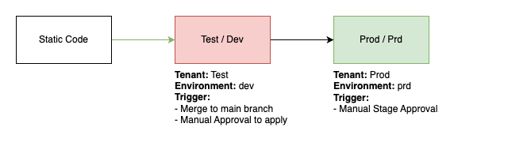

<!-- BEGIN_TF_DOCS -->
# alz_landingzone_platform

## Overview

This Terraform repository uses the internal `Terraform.LandingZones` module to provision Azure Subscriptions with some pre-configured defaults, such as:
- A base Virtual Network (or multiple if desired) with a given CIDR range
- A Service Principal and associated Connection with Azure DevOps or Github for the provided project.
- A Terraform State bucket which can be used within Azure DevOps pipelines or Github Action.
- An Azure DevOps Variable Group or Github Environment Variables containing details for the Terraform State bucket and Subscription IDs

**Note:** Within this repository, only **Platform Subscriptions** (those which are intended for central operations and shared services) should be defined. For **Application Subscriptions**, use the `ALZ.LandingZones.Apps` repository.

## Updating Docs

The `terraform-docs` utility is used to generate this README. Follow the below steps to update:
1. Make changes to the `.terraform-docs.yml` file
2. Fetch the `terraform-docs` binary (https://terraform-docs.io/user-guide/installation/)
3. Run `terraform-docs markdown table --output-file ${PWD}/README.md --output-mode inject terraform/`

## Release Process

The `Terraform.LandingZones` module is automatically tagged upon merge to the `main` branch. When a new version of the module is released, the `ALZ.LandingZones.Platform` repository should be updated to use the new version. This is done by updating the `source` parameter in the `main.tf` file to point to the new version.

Any changes to Landing Zones should be performed on a feature branch and merged to the `main` branch once approved. The `main` branch is protected and requires at least one approval before merging. The release process to the Test and Prod Tenants is automated and triggered through manual approvals in Azure DevOps. The below diagram shows the release process for a Platform Landing Zone:



## Required Pipeline Variables

The following variables are required to be set before running Terraform:
- platform_environment: Platform Landing Zones are deployed both to the **Test** and **Prod** Azure Tenants.
- **Test:** The `dev` environment for a Platform Landing Zone is built here. This is where any changes to the Landing Zone (e.g. the module version, configuration or underlying service) is tested and validated before being promoted to the **Prod** environment.
- **Prod:** The `prd` environment for a Platform Landing Zone is built here. This is where the Landing Zone is considered to be "production ready" and can be used by all application workloads in the **Prod** Tenant (`dev`, `pre` and `prd` environments).
- core_storage_account_name: Read access is required to the Core Storage Account and the Terraform State within it. The State file contains the IDs for the Azure VWAN Hubs (provisioned by `ALZ.Connectivity`), which are required for connecting the Landing Zone to the Hub Network.

**Azure DevOps**
- devops_org_name: The name of the Azure DevOps organisation all projects are located.
- devops_pat: An Azure DevOps Personal Access Token for authentication.

**Github**
- github_repository: The name of the Github repository.
- github_owner: The name of the Github organisation or user the repository belongs to.
- GH_TOKEN: Repository environment variable containing a Github Personal Access Token for authentication.

## Landing Zone Variables

The below code is an example of how to define a Platform Landing Zone in the `main.tf` file.

```terraform
module "devops-agents" {
  source = "git::https://dev.azure.com/appvia/Azure%20Landing%20Zones/_git/Terraform.LandingZones?ref=v1.0.0"

  platform_environment = var.platform_environment # Passed via pipeline variable
  app_environment      = var.app_environment      # Passed via pipeline variable
  subscription_ids     = local.subscription_ids   # Read from core remote state, used to create the Variable Group

  # Multiple virtual networks can be defined here and built in the `dev` and `prd` Landing Zones
  virtual_networks = {
    main = {                                                   # This is the name of the virtual network (can be called anything)
      azurerm_virtual_hub_id = local.uksouth_virtual_hub_id # Read from core remote state
      address_space = {                                        # Two different Tenants, so the address spaces can be the same as they are not connected
        dev = ["10.30.1.0/24"]                                 # The address space(s) for the `main` virtual network in the `dev` Landing Zone (Test Tenant)
        prd = ["10.30.1.0/24"]                                 # The address space(s) for the `main` virtual network in the `prd` Landing Zone (Prod Tenant)
      }
    }
  }

  private_dns_zones = data.terraform_remote_state.core.outputs.azurerm_private_dns_zone # Read from core remote state, used to create the Private DNS Links

  state_uses_private_endpoint = var.bootstrap_mode != "true" # When initially deploying the stack, private endpoints are not available. This is controlled via a pipeline variable.

  directory_roles = [ # Directory Roles can optionally be assigned the Service Principal created for the Landing Zone, when it is required.
    "Application Administrator"
  ]

  rbac = {
    template_name = "standard"
    create_groups = true # Create custom ALZ RBAC groups for the Landing Zone
  }

  devops_project_name = "##DEVOPS_PROJECT_NAME##" # The name of the Azure DevOps project where the Service Connection and Variable Group will be created. If using GitHub for CI this would be replaced with the variables github_repository and github_org'
  management_group    = "internal"                             # The name of the Management Group where the Subscription will be created (either "internal" or "external")
  subscription_name   = "devops-agents"                        # A unique name (across the Tenant) for the Subscription to be created
  subscription_tags = {
    WorkloadName        = "ADO.AgentPools"
    DataClassification  = "General"
    BusinessCriticality = "Mission-critical"
    BusinessUnit        = "Platform Operations"
    OperationsTeam      = "Platform Operations"
  }
}
```
<!-- END_TF_DOCS -->